## This is my First Assignment

## I have practiced and created a web page.

# [Anonna_portfolio](https://anonnagh.github.io/anonna_portfolio/)

# Intro to Course Note
                    Class-1
* We will learn how to look at a basic design mockup and translate it to HTML and CSS to create a basic web page.
* We will develop a CSS Framework ,which will help us make websites much faster and easier.
* We will learn about responsive design,which is a principle that helps us reach people on any device that they are using to see our website .
* We will be taking on a professional framework. 
A static website using Twitter’s     Bootstrap framework.
#

                    Class-2
* How do you translate the visual design into an actual website?
* At first we should probably build a good conceptual understanding of the way websites work.
       HTML=The structure 
       CSS=Style 
       Javascript=interactive component 

#

                  Class-3
* We Will take a look at wikipedia .
* Inner Structure of wikipedia.


## Go Google chrome browser
                  |
         Right click
                  |
             Inspect


#

               Class-4
Observing wikipedia structure :
* All elements are rectangular .
* You can read the same text as on the page .

#

Class-5
Html element :

#

* Opening tag 
* Closing tag
#

                   Class-6
* I understand page structure .But 

### 1.How does  the browser know  what the structure is and how to display it?
### 2.How does it know what images to display?
### 3.How html classifies page content ?

* It tells the browser which part is text and which part is an image and so on.
But we haven't seen how  the structure is turned into the actual page ,with certain paragraphs having a large font size and images positioned in some way on the page.

#

              class-7 & 8
* Element and style
              Class-9
## HTML (Hyper text Markup Language)
Language  —-- syntax + text
The basics of the language of a tag .
The browser turns HTML tags into elements that are from tree.

## Dom(Document Object model)

* The browser turn html tags into element that from a tree .
* It know how to do that because  of the DOM is a standard convertation for representating and interasting which element in html.
* So the tree we saw in developer tool was relly the DOM tree that browser built from an html document.

* Each html tag create an element in the DOM that the browser uses to display the page.
 


 * Each html tags has attributes and values.
  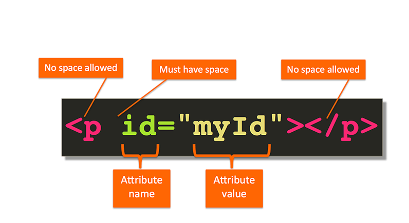

## CSS(Cascading Style Sheet)

* To define the style ,we use another language CSS.
* How element looks on the page 
            
            The sige of font
            The color 
            Background 
            Boders
            position etc 

# 
             Class-10 &11 &12

* Actual thinking of the think in term of boxes makes your life as a fontend web developer.

        Class-13 & 14 & 15
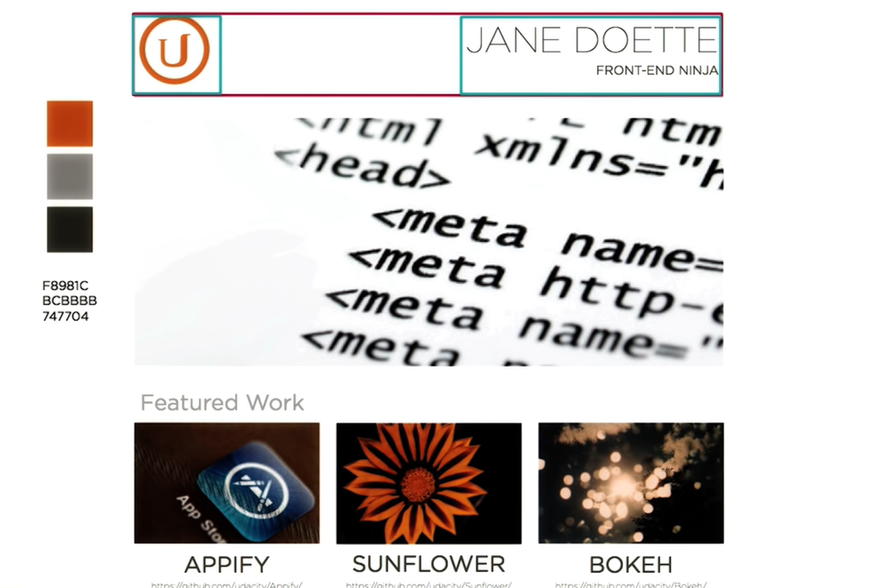


        Class-16
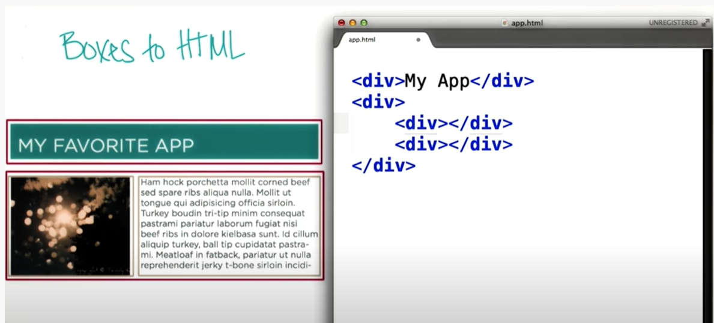
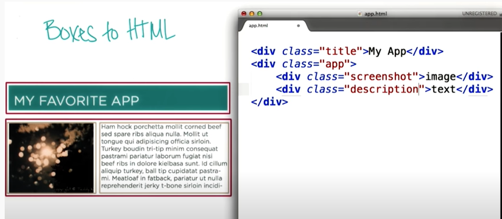

            Class-17
``` html
<!DOCTYPE html>
<html>
<head>
<title>HTML Tutorial</title>
<link rel ="stylesheet" type="text/css" href="style.css">
</head>
<body>

<h1>This is a heading</h1>
<p>This is a paragraph.</p>

</body>
</html>
```

             Class-18
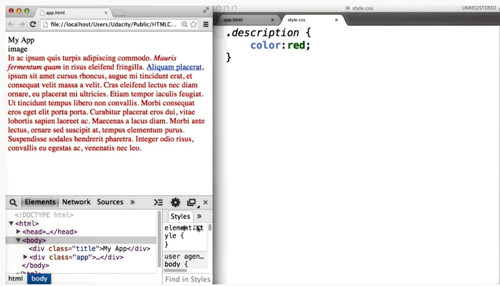

            Class-19
## What is CSS?
* CSS stands for Cascading Style Sheets
* CSS describes how HTML elements are to be displayed on screen, paper, or in other media
* CSS saves a lot of work. It can control the layout of multiple web pages all at once
* External stylesheets are stored in CSS files
 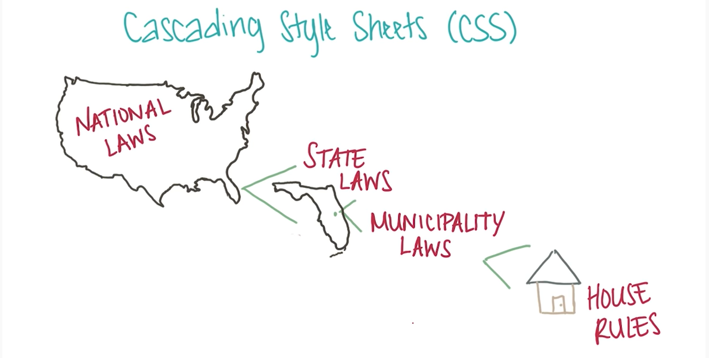    

            class-20 & 21

# font-style 
* normal
* Halic
* Oblique

#
# Font-weight

* normal
* Bold
* lighter
* Bolder
#
              Class-22
* Heading h1,h2,h3
``` html
<!DOCTYPE html>
<html>
<body>

<h1>Heading 1</h1>
<h2>Heading 2</h2>
<h3>Heading 3</h3>
<h4>Heading 4</h4>
<h5>Heading 5</h5>
<h6>Heading 6</h6>

</body>
</html>
```
<!DOCTYPE html>
<html>
<body>

<h1>Heading 1</h1>
<h2>Heading 2</h2>
<h3>Heading 3</h3>
<h4>Heading 4</h4>
<h5>Heading 5</h5>
<h6>Heading 6</h6>

</body>
</html>

                 Class-23
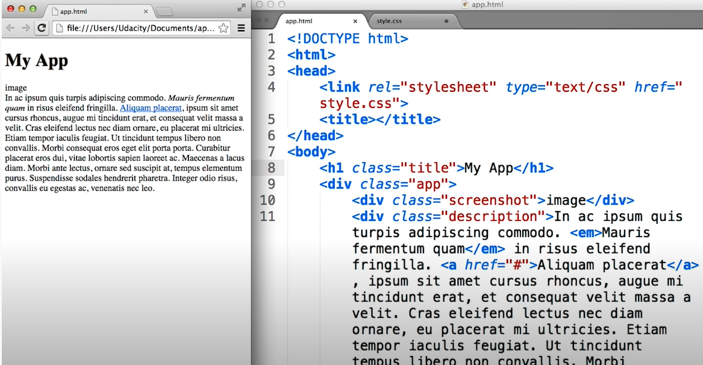

              Class-24
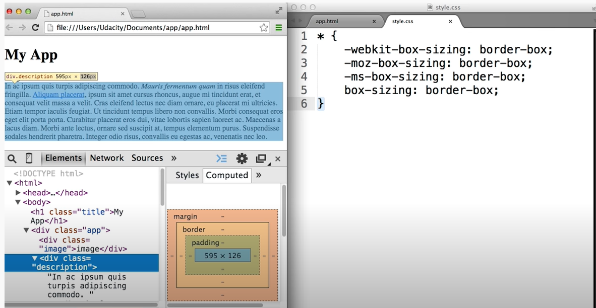

             Class-25
# Flex box layout :
* Flex box means fleaxible box and it provide an efficient way to layout ,align and distribute space among item in a container or div.
### display: flex

           Class-26 & 27
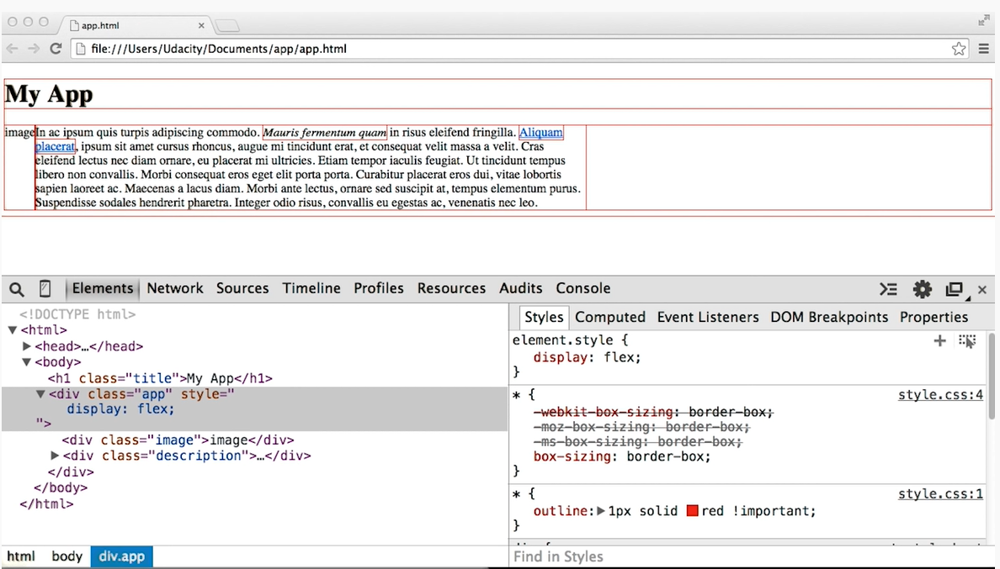

           Class-28
# Chrome Developer Tools

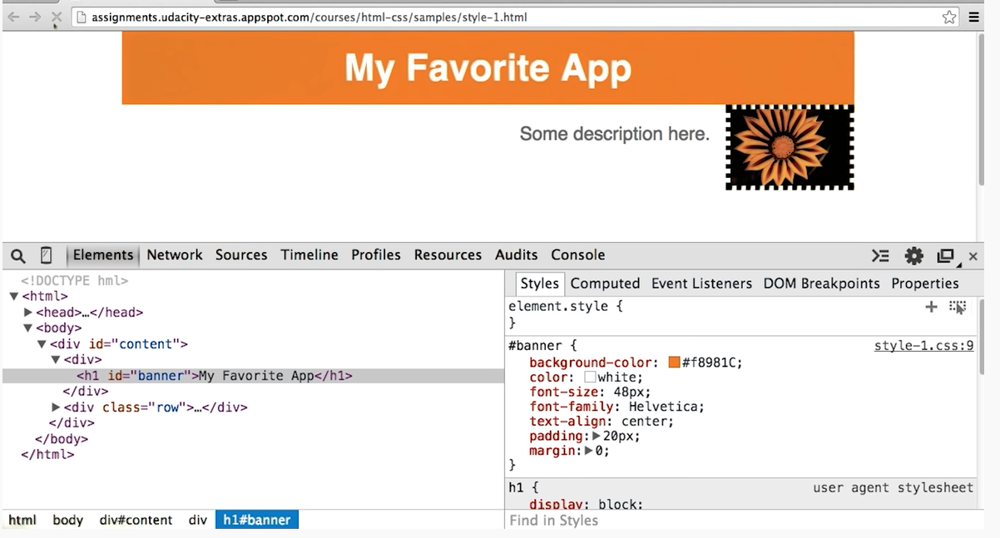

         
              Class-29
  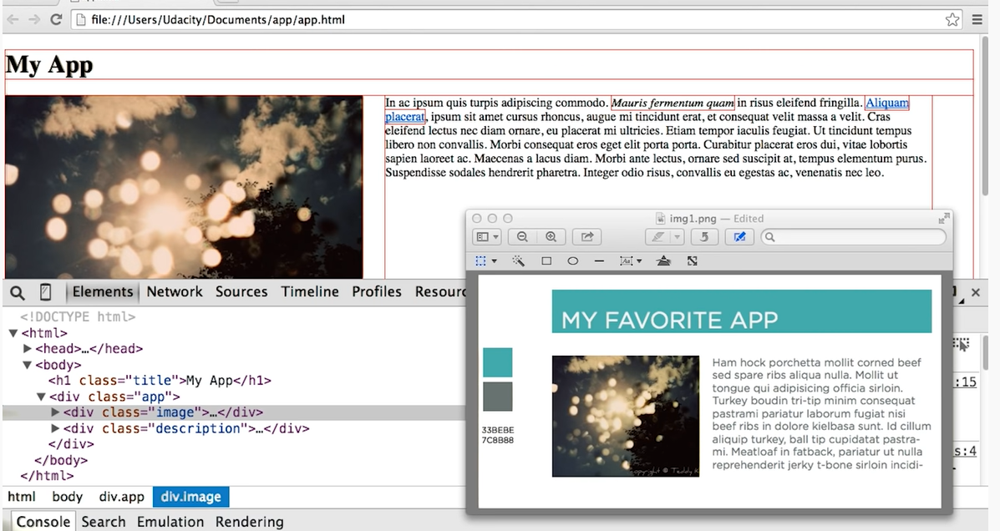        
 
              Class-30
              
## Validating and Verifying HTML and CSS

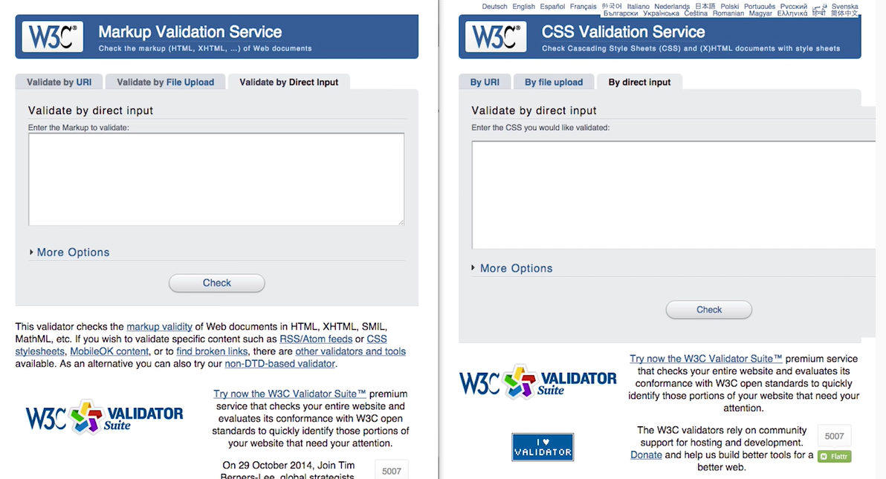 


            Class-37
## Adaptive design :
You may need to change your layout a bit further to make it easier use.Thia is call adaptive design.
## Responsive :
Simply change the size of the page fit.

         Class-38
## Implementing Responsive Design 

* Which of the following grid size allows for just enough costomization?

* Ans: 12 columns

#
        Class-41
### Which CSS classes should you create ?
* .row is 100% page weidth 
* I put the . here when we writing CSS we will need identify that something is a class putting a dot if font of it.
#
      Class-42
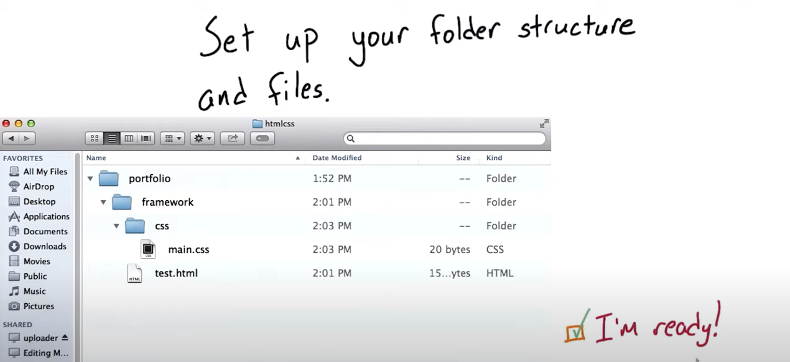 
#
     Class-42 & 43
  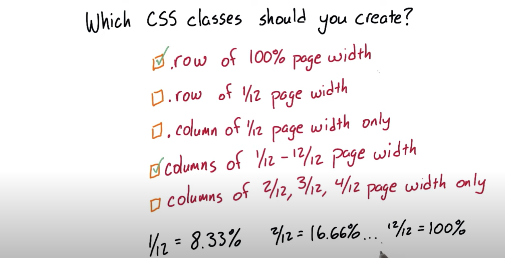  

#

           Class-44
 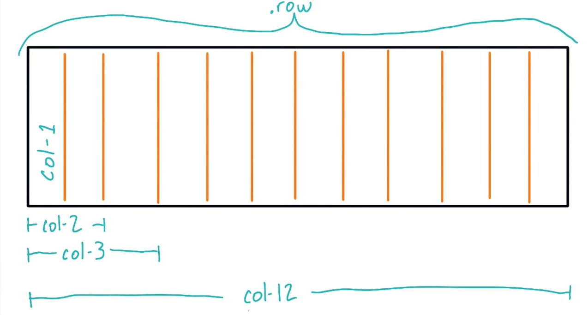 

  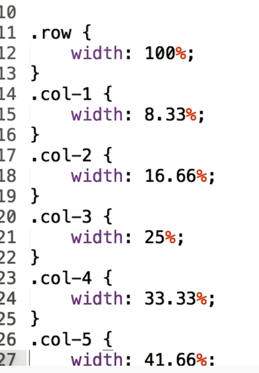

 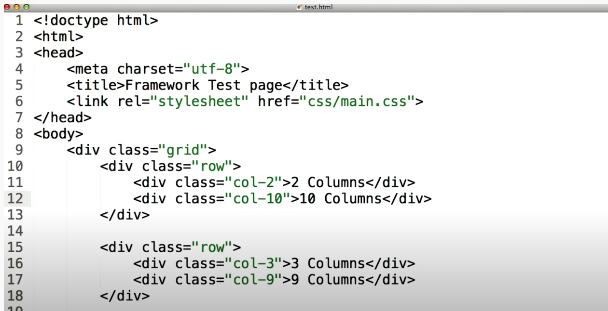 

 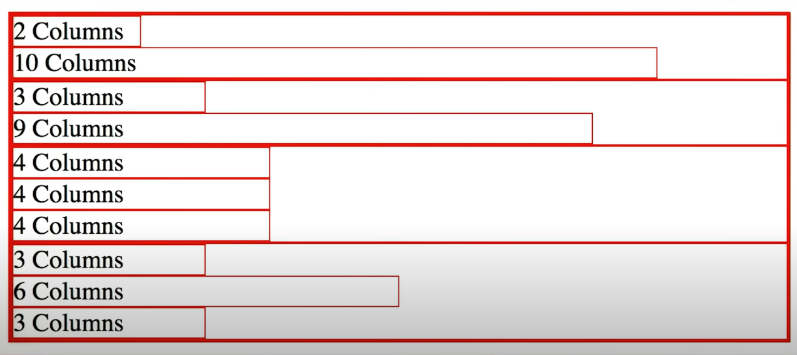 
  #

         Class-45
## What style should we add to .row's CSS to fix the way columns behave?
### Ans: display :  flex
###      display:   wrap  

             
             
## Class-46 
   

