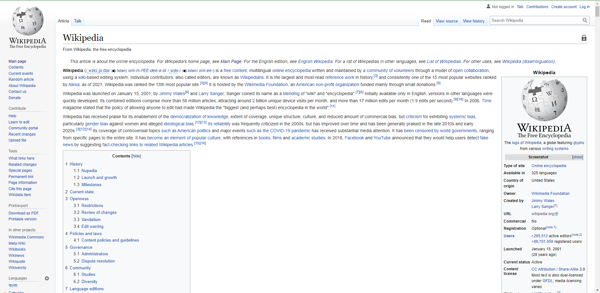
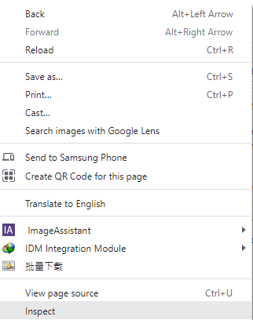

## This is my First Assignment

## I have practiced and created a web page.

# [Anonna_portfolio](https://anonnagh.github.io/anonna_portfolio/)

# Intro to Course Note
                    Class-1
* We will learn how to look at a basic design mockup and translate it to HTML and CSS to create a basic web page.
* We will develop a CSS Framework ,which will help us make websites much faster and easier.
* We will learn about responsive design,which is a principle that helps us reach people on any device that they are using to see our website .
* We will be taking on a professional framework. 
A static website using Twitter’s     Bootstrap framework.
#

                    Class-2
* How do you translate the visual design into an actual website?
* At first we should probably build a good conceptual understanding of the way websites work.
       HTML=The structure 
       CSS=Style 
       Javascript=interactive component 

#

                  Class-3
* We Will take a look at wikipedia .
* Inner Structure of wikipedia.

## Go Google chrome browser
                  |
         Right click
                  |
             Inspect

#

               Class-4
Observing wikipedia structure :
* All elements are rectangular .
* You can read the same text as on the page .

#

Class-5
Html element :

#

* Opening tag 
* Closing tag
#

                   Class-6
* I understand page structure .But 

### 1.How does  the browser know  what the structure is and how to display it?
### 2.How does it know what images to display?
### 3.How html classifies page content ?

* It tells the browser which part is text and which part is an image and so on.
But we haven't seen how  the structure is turned into the actual page ,with certain paragraphs having a large font size and images positioned in some way on the page.

#

              class-7 & 8
* Element and style
              Class-9
HTML (Hyper text Markup Language)
Language  —-- syntax + text
The basics of the language of a tag .
The browser turns HTML tags into elements that are from tree.

#

