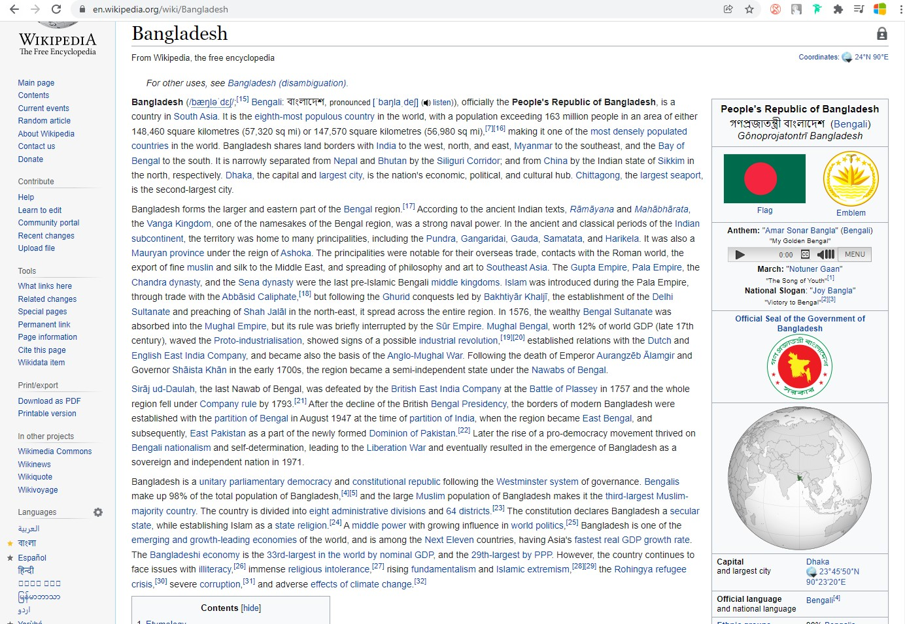
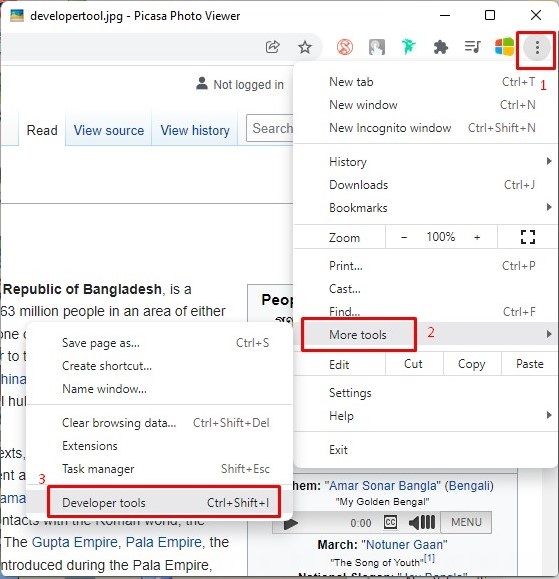
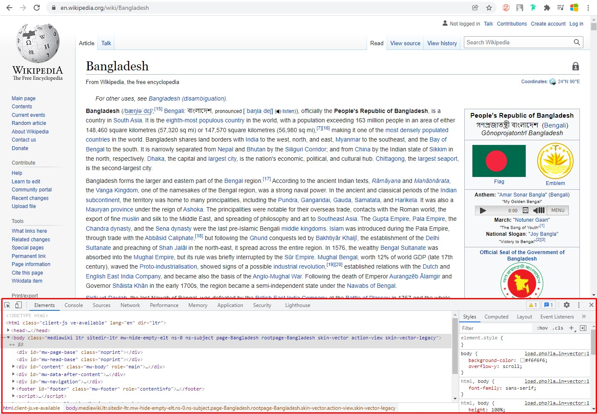

## HTML এবং CSS এর ভূমিকা- [HTML fundamentals](https://www.youtube.com/watch?v=1cZtdKNB9jo&list=PLAwxTw4SYaPmd5v7c9i883AwqVZquegHM)
সবাইকে সু-স্বাগতম এবং ধন্যবাদ আমাদের এই কোর্সে যোগদান করার জন্য। 

## [Part-1](https://youtu.be/1cZtdKNB9jo)

এখন আপনি সম্ভবত ভাবছেন কেন এই কোর্সটিকে আপনার HTML এবং CSS এর সাধারণ ভূমিকা বলা হয় নি।
কারণ আমরা আপনাকে শেখাতে যাচ্ছি না যে শুধুমাত্র কিভাবে একটি টাইটেল (title) এবং কিছু বডি(body) সহ একটি ওয়েবপেজ তৈরি করতে হয়। বরং, আমরা আপনাকে একটি নির্দিষ্ট ওয়েবপেজ (webpage) কে ভেঙে তার ভিতরে থাকা কোড দেখে তার মাধ্যমে  আমরা আপনার নিজের জন্য এটিকে পুনরায় ওয়েবপেজ তৈরি করার পদ্ধতিগত উপায় শেখাতে যাচ্ছি। 

আপনি জানেন, HTML এবং CSS সময়ের সাথে সাথে বিকাশ এবং পরিবর্তন হয় এবং হচ্ছে। কিন্তু জন্মগত কার্যক্রম বা নীতি সবসময় একই থাকবে। আপনি যদি একটি নির্দিষ্ট শেখার বা কাজ করার কৌশল জানেন তাহলে সেটি  অনেক সহজ হয়ে যায় আপনার জন্য। 

 <strong>প্রথম পাঠে,</strong> আমরা শিখবো একটি ওয়েবপেজের প্রাথমিক নকশা বা ডিজাইন দেখতে কেমন হয় এবং কিভাবে একটি ওয়েবপেজের প্রাথমিক নকশা বা ডিজাইন  তৈরি করতে html এবং css-এ একসাথে কাজ করতে হয়।
 এবং <strong>দ্বিতীয় পাঠে,</strong>  আমরা একটি CSS ফ্রেমওয়ার্ক তৈরি করবো, যা আমাদের ওয়েবসাইটকে আরও দ্রুত এবং সহজ করতে সাহায্য করবে।
এবং পথ চলতে চলতে আমরা রেস্পন্সিব ডিজাইন সম্পর্কে জানবো, যেটি একটি কার্যক্রম বা নীতি যা আপনাকে সাহায্য করবে যে কোনো ডিভাইসে বিভিন্ন লোকেদের কাছে পৌঁছাতে, যাতে তারা আপনার এই ওয়েবসাইটটি  সুন্দর ভাবে দেখতে পাই।

<strong>শেষ পাঠে,</strong> আপনি একটি professional framework গ্রহণ করবেন। যেমন আপনি টুইটারের বুটস্ট্র্যাপ ফ্রেমওয়ার্ক ব্যবহার করে একটি স্ট্যাটিক ওয়েবসাইট তৈরি করতে পারবেন , যা ডেভেলপাররা প্রতিদিন বিভিন্ন ক্ষেত্রে ব্যবহার করে থাকেন।

 <strong>এই কোর্সটি ফ্রন্ট-এন্ড ওয়েব ডেভেলপার হওয়ার জন্য আপনার যাত্রার শুরু মাত্র।</strong>

## তাহলে শুরু করা যাক 
### [Part -2](https://youtu.be/xIOeccZZ-5g)

এখন আপনার নিজেকে কল্পনা করুন আপনি একজন ফ্রন্ট-এন্ড ওয়েব ডেভেলপার আপনি আপনার কোম্পানির গ্রাফিক ডিজাইন থেকে একটি ডিজাইন পেয়েছেন এবং আপনাকে এখন এই ডিজাইন থেকে ছবি বা পিডিএফ ফাইল নিতে হবে এবং সমস্ত প্রয়োজনীয় ফাইল একটি নির্দিষ্ট ফোল্ডারে রেখে তারপর একটি ওয়েবসাইটে  তৈরী করতে সাহায্য করবে।   <strong>যেমন - এইচটিএমএল ফাইল, সিএসএস ফাইল এবং জাভাস্ক্রিপ্ট ফাইল।</strong>
কিন্তু কীভাবে আপনি সেই ভিজ্যুয়াল ডিজাইনটিকে একটি প্রকৃত ওয়েবসাইটে পরিণত করবেন, জানেন কী কীভাবে?

এবং আপনি কোথা থেকে শুরু করবেন? আপনার কি সিদ্ধান্ত নিতে হবে?আপনার কি কি জানা দরকার? এগুলো নিজেকে বা অন্যকে জিজ্ঞেস করার মত দুর্দান্ত প্রশ্ন
 এই মুহূর্তেে, <strong>html ফাইলটি</strong> আপনি আপনার বাড়ির মতো একটি ওয়েবসাইট ভাবতে পারেন। html ফাইলটি একটি স্ট্রাকচার এর মতো যেখানে আপনার দালান দেয়ালটি স্থাপন করা হয়েছে।  <strong>যেমনঃ - আপনার বসার ঘর | আপনার রান্নাঘর | আপনার শোয়ার ঘর। </strong>

<strong> css ফাইলগুলি </strong> হলো আপনার বাড়ির সৌন্দর্য বা স্টাইল।
যেমনঃ  আপনার ঘরের গালিচা কি রঙের হবে? আপনার দেয়ালের রঙ কি হবে? ইত্যাদি।  

<strong>javascript</strong> ফাইলগুলি আপনার একটি ইন্টারেক্টিভ উপাদান (component)। 
যেমনঃ আপনি আপনার গ্যারেজ দরজা অটো খুলে যাবে একটা বাটন চেপে দেয়ার মাধ্যমে, বা আপনার টেলিভিশন রিমোট, যা আপনার বাড়ির কিছু উপাদান পরিবর্তন করার মাধ্যমে জীবন আরো সহজ ও সুন্দর হয়ে উঠে। 
আপনার বাড়ির জিনিসগুলি কীভাবে সাঁজাবেন তার জন্য কিছু নিয়ম রয়েছে, যেমন আপনার কাছে এমন একটি টেলিভিশন থাকতে পারে না যা কেবল দেয়ালে লাগানো আছে। এটি কোনো কিছু দ্বারা সংযুক্ত তো করতে হবে তাই না । 
ওয়েবসাইটগুলি ঠিক ওই ভাবে সাজাতে হয় এবং তার জন্য নিয়মও রয়েছে৷ আবার একই সরঞ্জাম দিয়ে অন্য কাজ করা যায় যেমনঃ আপনি একটি বুকশেলফ একসাথে রাখতে পারেন। উদাহরণস্বরূপ- স্ক্রু ড্রাইভার (টুল) এর মাদ্ধমে এটিকে দেয়ালে এটাচ করতে সাহায্য করে। ঠিক আপনার ওয়েবসাইট তৈরি করতে সাহায্য করে এমন অনেক ওয়েব টুল আছে।

## [Part -3](https://youtu.be/_e-gGAM4noQ) 
<strong>উদাহরণ স্বরূপ,</strong> উইকিপিডিয়ার ওয়েবপেজটি আমার যদি দেখি।
আপনি এখানে দেখতে পারছেন , এই পৃষ্ঠায় অনেক কিছু আছে. টেক্সট এবং বিভিন্ন আকারের অনেকগুলি বিভিন্ন চিত্র রয়েছে

এখন আমরা সাইটের অভ্যন্তরীণ কাঠামোটি একবার দেখে নেয়ার চেষ্টা করি। আমি আমার ব্রাউজার হিসেবে গুগল ক্রোম ব্যবহার করছি, যার মধ্যে সত্যিই দারুণ একটি ডেভেলপার টুল রয়েছে। যেটি আপনার স্ক্রিনে দেখা যাচ্ছে এবং আপনি আমার সাথে অনুসরণ করতে ভুলবেন না. প্রথমে গুগল ক্রোম ওপেন করুন ,আপনার স্ক্রিনের উপরের ডানদিকে তিনটি ডট আইকনটি "Three Dott Icon" নির্বাচন করুন এবং মোর টুল  "More tools" লিখার উপর ক্লিক করুন এরপর ডেভেলপার টুল "Developer tools" নির্বাচন করুন ।

ব্রাউজারের নীচে একটি অতিরিক্ত প্যানেল খুলবে।
 

এটি আপনাকে ওয়েবপেজের গঠন দেখায়। এবং এটি একটি সত্যিই গুরুত্বপূর্ণ তথ্য জানার জন্য। আপনি এখানে যা দেখছেন তা প্রকৃত কোড নয় বরং ওয়েবপেজের কাঠামো যা ব্রাউজার আপনাকে ওয়েবপেজের ব্যাখ্যা দেখায় ।
